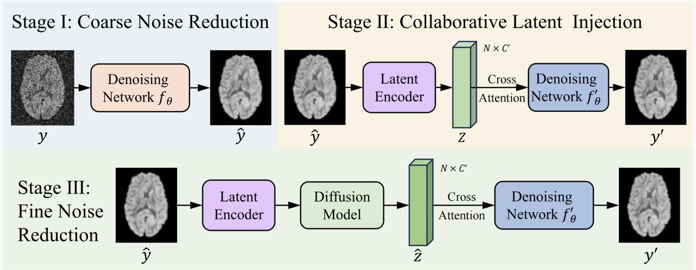

# Self-Supervised Denoising of Diffusion MRI Data with Efficient Collaborative Diffusion Model. IPMI 2025



## Dependencies

Please clone our environment using the following command:

```
conda env create -f environment.yml  
conda activate ecdm
```

## Usage

### Data

For fair evaluations, we used the real data provided in the [DIPY](https://dipy.org/) library. One can easily access their provided data (e.g. Sherbrooke and Stanford HARDI) by using their official loading script:  

```python3
hardi_fname, hardi_bval_fname, hardi_bvec_fname = get_fnames('stanford_hardi')
data, affine = load_nifti(hardi_fname)
```

### Configs

Different experiments are controlled by configuration files, which are in ```config/```. 

We have provided default training configurations for reproducing our experiments. Users are required to **change the path vairables** to their own directory/data before running any experiments. *More detailed guidances are provided as inline comments in the config files.*

### Train

This project adopts a three-stage training pipeline to progressively improve denoising performance. The following outlines how to train and validate the model in each stage.

1. **To train our Stage I:**
   
    ```python3 train_stage1.py -p train -c config/hardi_150.json```
   
	After Stage I training completed, you can **test** the performance of the current model by following command:
	```python3 train_stage1.py -p val -c config/hardi_150.json```

2. **To train our Stage II:**
   
    **Befor starting the trainning of the Stage II** ,  you need to fill in the path weight of the stage I into the corresponding resume_state field in the config file. For example:
    
    ```json
     "train": {
          "latent_state": null,  // Leave this as null for Stage 2
          "resume_state": "experiments/hardi_stage1_250516_161346/checkpoint/latest"
      }
    ```
    
    **Then start the training:**
    ```python3 train_stage2.py -p train -c config/hardi_150.json```
   
    **Validate Results:** 
    ```python3 train_stage2.py -p val -c config/hardi_150.json```  

3. **To train our Stage III:**

    **Befor starting the trainning of the Stage III** ,  you need to set the `latent_state` field in the config file to the checkpoint from Stage II. For example:
    
    ```json
      "train": {
          "latent_state": "experiments/hardi_stage2_250518_101520/checkpoint/",  
          "resume_state": "experiments/hardi_stage1_250516_161346/checkpoint/latest"
      }
    ```
    
    **Start Training:**
    ```python3 train_stage3.py -p train -c config/hardi_150.json```
   
    **Validate Results:**
    ```python3 train_stage3.py -p val -c config/hardi_150.json```  

4. When **testing the third stage**, **the trained weights should still be assigned to `latent_state`** in the configuration file.
5. Validation **results** along with checkpoints will be saved in the ```/experiments/result``` folder.


### Quantitative Metrics Calulation

- With the denoised Stanford HARDI dataset, please follow the instructions in ```quantitative_metrics.ipynb``` to calculate **SNR and CNR** scores.

  *This notebook is derived from this [DIPY script](https://dipy.org/documentation/1.1.0./examples_built/snr_in_cc/). Please respect their license of usage.*

- If you have **GT**, you can also run `python psnr_slice.py` to calculate **PSNR, SSIM and RMSE** for the slice you are interesting in.


- The code for the relevant **comparison methods** we used in the paper is published in the `./comparison` folder.
